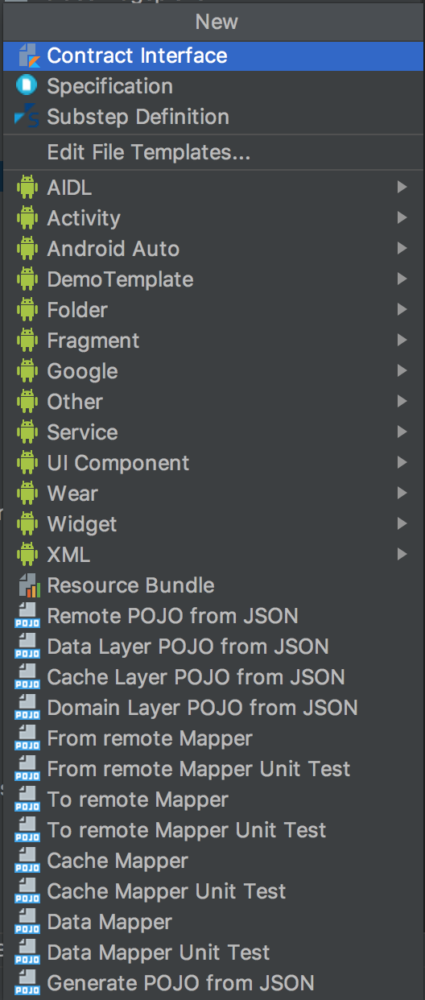
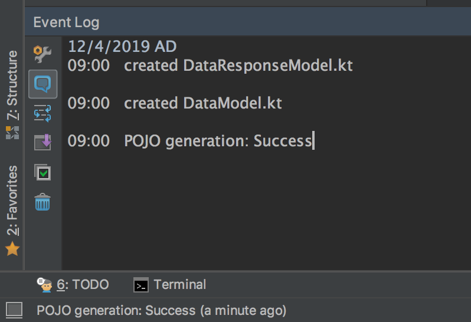

# Android Clean Architecture Generator

This is an internal plugin but openly to use, I make for using very specific Android Clean Architecture [https://github.com/bufferapp/android-clean-architecture-boilerplate]  

# Road map
The road map of this project is generate the whole things from plain JSON all the way through to Domain Layer and this plugin will be extended to generate android UI template
Currently, Generate Kotlin POJO files from JSON  
  - Domain POJO
  - Data POJO
  - Cache POJO
  - Remote POJO
  - Generate mapper with Unit testing template
      

### Waiting for image

# Download
get it and install from <a href="https://plugins.jetbrains.com/plugin/12213-android-clean-architecture-generator">plugin repository</a> or simply find it in "Preferences" -> "Plugins" -> "Browse Repositories" -> "Android Clean Architecture Generator"

### Waiting for image

# How to use

- Select target package -> new -> Domain POJO from JSON
- Select target package -> new -> Data POJO from JSON
- Select target package -> new -> Cache POJO from JSON
- Select target package -> new -> Remote POJO from JSON
- Select target package -> new -> From remote mapper
- Select target package -> new -> From remote mapper unit test
- Select target package -> new -> To remote mapper
- Select target package -> new -> To remote mapper unit test
- Select target package -> new -> Cache mapper
- Select target package -> new -> Cache mapper unit test

put JSON into window and select target POJO type

Waiting for image

see log of changes

# About
This project is on top of https://github.com/robohorse/RoboPOJOGenerator  
Thank you to Vadim Shchenev to make me easier to extend.
